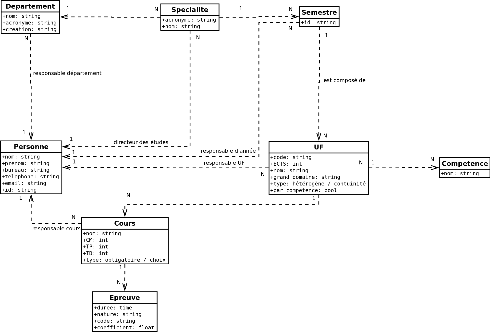
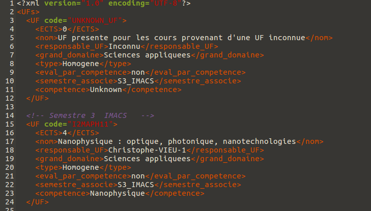
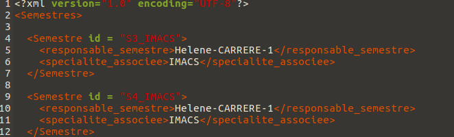

Maxime ARENS, [arens@etud.insa-toulouse.fr](mailto:arens@etud.insa-toulouse.fr)

Benjamin BIGEY, [bigey@etud.insa-toulouse.fr](mailto:bigey@etud.insa-toulouse.fr)

Jordan DELENTE, [delente@etud.insa-toulouse.fr](mailto:delente@etud.insa-toulouse.fr)

Thomas MAISIERES, [maisiere@etud.insa-toulouse.fr](mailto:maisiere@etud.insa-toulouse.fr)

# Rapport du projet MDSI

Ce projet est réalisé dans le cadre du module MDSI lors de la formation de 4ème année à l'INSA Toulouse, en Informatique et Réseaux.

Le code source de ce projet est [entreposé sur un dépôt GitHub](https://github.com/Terae/MDSI/tree/master/Project).

## Objectif

Ce Bureau D'Étude a pour objectif de gérer la maquette des cours de l'INSA pour les étudiants étrangers.

La base de donnée est sous forme de XML, la validation schématique se fait grâce à un XSD et des fichiers XSL permettent de générer des fichiers HTML pour aider les étudiants étrangers avec un affichage utilisable.

## Travail en commun

### Conception de la base de donnée

Après avoir reçu le cahier des charges, nous avons commencé à définir un diagramme UML qui explicite la base de donnée répondant au problème.

Voici une image de ce diagramme final. Un [fichier PDF](https://github.com/Terae/MDSI/blob/master/Project/UML.pdf) est également disponible.

### Écriture des bases de données

Une fois que l'on était d'accord sur l'architecture des bases de données, nous nous sommes répartis l'écriture des différentes classes dans des fichiers différents pour paralléliser les tâches.

Cette parallélisation nous a permis d'utiliser de maière optimale l'outil github : on était indépendant sur nos différents fichiers.

Ainsi, le [fichier XSD principal](https://github.com/Terae/MDSI/blob/master/Project/src/INSA.xml) est une succession de balises `<xi:include>` tandis que chaque classe est renseignée dans des fichiers séparés.

Un simple appel à la fonction `xmllint --xinclude <file.xml> > <file.generated.xml>` permets à posteriori de n'avoir qu'un unique fichier XML utilisable pour générer des documents utiles aux étudiants étrangers.

### Validation du XSD

Une fois que les documents XML étaient bien avancés, on a commencé à rédiger le XSD pour valider l'ensemble de la base de données.

Nous avons fait le choix de rédiger les XML puis de rédiger différents XSD correspondant à chaque XML. Ça permettait à chacun de s'occuper d'une classe dans sa globalité, c'est à dire qu'après nous être réparti les classes, on pensait chacun écrire son document XML et XSD.

Cependant, ce procédé n'était pas le bon et nous a fait perdre du temps car les classes sont liées entre elles, et notamment le [fichier regroupant les personnes](https://github.com/Terae/MDSI/blob/master/Project/src/Personnes.xml) est utilisé par tous les autres fichiers.

Ainsi, on a centralisé la rédaction du fichier de validation. Les documents XML ont ainsi pu être validés relativement tôt dans leur écriture.

### Génération de documents HTML

Une fois que toute la base de donnée a été remplie et validée, on a commencé à écrire différents fichiers XSL pour fournir aux étudiants des fichiers web plus lisibles.

On en a écrit huit différents pour fournir une prévisualisation efficace des différentes formations proposées par l'INSA :
* [Liste des compétences par spécialité](https://github.com/Terae/MDSI/blob/master/Project/src/listeCompParSpe.xsl)
* [Liste des cours par spécialité](https://github.com/Terae/MDSI/blob/master/Project/src/listeCoursParSpe.xsl)
* [Liste des épreuves](https://github.com/Terae/MDSI/blob/master/Project/src/listeEpreuves.xsl
* [Liste des responsabilités de chaque personne](https://github.com/Terae/MDSI/blob/master/Project/src/listeRespo.xsl)
* [Liste des Unités de Formation par spécialité](https://github.com/Terae/MDSI/blob/master/Project/src/listeUFImportantes.xsl) qui rapportent plus de 5 crédits ECTS
* [Liste de toutes les Unités de Formation par spécialité](https://github.com/Terae/MDSI/blob/master/Project/src/listeUfParSpe.xsl)
* [Nombre d'heures de chaque cours](https://github.com/Terae/MDSI/blob/master/Project/src/NbHeuresCours.xsl)
* [Liste des pré-orientations](https://github.com/Terae/MDSI/blob/master/Project/src/PO.xsl)

## Travail individuel : répartition des tâches

### Maxime ARENS

Pour commencer j’ai participé au brainstorming duquel a émergé la première version du diagramme UML. Ensuite j’ai faire des recherches sur les diverses sites internet de l’INSA afin de trouver des informations complémentaires pour compléter les diverses fichiers xml.

 Lors de la répartition des tâches j’ai choisi de m’occuper d’un seul fichier xml qui était conséquent à écrire, Specialites.xml dans le but de pouvoir ensuite passer plus vite sur la réalisation des fichiers xsd avec Benjamin Bigey. En raison de nos plus grandes difficultés sur les fichiers xsd nous avons travaillé en binôme avec Benjamin. Nos problèmes étaient principalement liés sur l’utilisation des key/keyrefs qui nous on posé des problèmes sur plusieurs séances à nous et notre professeur de TD.

 Une fois ce problème réglé j’ai laissé Benjamin continué à rédiger les xsd afin de les faire fonctionner parfaitement et je me suis penché sur les fichiers xsl. J’ai mis toute l’avant-dernière séance à faire un xsl qui permettait de répondre à une requête complexe. Après à partir de cet exemple fonctionnel j’ai pu plus facilement faire les autres xsl pendant les vacances (listeCompParSpe.xsl, listeCoursParSpe.xsl, listeEpreuves.xsl, listeUfImportantes.xsl, listeUfParSpe.xsl). J’ai de plus réalisé NbHeureCours.xsl, listeRespo.xsl et PO.xsl avec Jordan et Thomas le jour de la rentrée afin de leur montrer la réalisation de xsl fonctionnels.

  Pour la réalisation des xsl il est important de savoir que j’ai eu des discussions sur le fond de ceux-ci avec Benjamin et qu’il en a découlé le fait de ne pas faire exactement ce que notre professeur nous avait proposé comme requête mais de faire des requêtes dont le résultat nous semblait utile pour un élève étranger se renseignant sur l’INSA.
### Benjamin BIGEY

Durant ce projet, mon rôle global a été de coordiner le travail de toute l'équipe : j'ai encadré l'avancement du diagramme UML, je l'ai mis au propre sur ordinateur puis une fois qu'il était accepté par toute le monde j'ai converti la structure en 3NF.

Ensuite, après nous avoir réparti le travail d'écriture des documents XML, j'ai commencé à maintenir un [makefile](https://github.com/Terae/MDSI/blob/master/Project/src/makefile) pour automatiser le travail que l'on fait à partir des fichiers et j'ai mis en place un dépôt git pour qu'on puisse partager le travail.

J'ai rédigé la base de données [Departements.xml](https://github.com/Terae/MDSI/blob/master/Project/src/Departements.xml) puis je me suis occupé de l'intégralité du XSD de validation. Comme je l'ai précisé dans un paragraphe précédemment, notre volonté initiale par rapport au XML schéma était de chacun rédiger notre propre partie de validation, mais j'ai rencontré un problème lors de l'appel à `xmllint --schema <file.xsd> <file>xml>` dû au fait qu'on ne peut pas partager de clefs `<xsd:key>` et `<xsd:keyref>` entre différents fichiers XSD. Ainsi, après avoir récupérer les morceaux XSD propres à chaque XML de mes collègues, j'ai finalisé l'[unique fichier XSD](https://github.com/Terae/MDSI/blob/master/Project/src/INSA.xsd) avec l'ajout des clefs et des références entre les différentes bases de données.

Ensuite, j'ai modifié l'ensemble des documents XML pour correspondre au fichier XSD car la cardinalité entre les différentes classes dans les documents n'était pas respectée : pour une relation **`1:N`**, l'implémentation dans les bases de données spécifiait que la classe en **`1`** possède **`N`** lignes pour chaque classe fille, mais cette implémentation est incorrecte au vu des clefs de validation. J'ai ainsi changé la cardinalité de toutes les relations **`1:N`** du diagramme UML pour correspondre à une base de donnée 3NF, en rajoutant un champ dans la classe en **`1`** qui pointe vers la classe en **`N`**.

J'en ai également profité pour formater tous les documents XML pour notamment supprimer des espaces en trop qui faisaient que les clefs XSD ne pouvaient pas pointer vers le bon objet, garantir une convention de nommage identique au projet ainsi que pour indenter tous ces fichiers.

Enfin, après avoir réalisé tout ce travail de maintenance pour faire valider la base de donnée, j'ai rédigé le XSL qui permets de lister toutes les PO, et ce fichier a pu servir de template à mes collègues pour qu'ils rédigent les autres documents. Je me suis occupé de l'écriture finale du makefile pour qu'une target make puisse automatiquement générer tous les documents HTML à partir des XSL fournis.

### Thomas MAISIERES

Après avoir fait la conception du diagramme de classe en groupe, comme il est expliqué au dessus, il m'a été confié de m'occuper de la classe UF et Semestre en priorité, j'ai donc commencé par implementer le fichier UF.xml, contenant l'ensemble des UF du semestre 3 à 6, ainsi que les semestres 6 (pour chaque pré-Orientation existante) de MIC, IC et ICBE, avec le code, nombre de crédits ECTS apportés, le nom, le grand domaine, le type, le semestre associés, si c'est un semestre avec évaluation par compétences et la compétence acquise.

Je me suis ensuite occupé des Semestres, ou il fallait faire correspondre les Id des UFs implémentés précedemment. Il est constitué de Id, responsable semestre, et de la spécialité associées.

Il était important de respecter les mises en formes élaborées précedemment pour pouvoir avoir une concordance entre chaque fichier, par exemple la syntaxe pour les UFs, ou les noms ( Prenom-NOM-1 ) pour les responsables UF.

Puis pour finir avec les fichiers xml, avec Jordan on a implémenté le fichier xml Competences qui contient un identifiant, etant un nom de compétence, permettant aux UFs de faire référence à une compétence.

Ensuite, je suis passé à la partie XML-Schema, sur INSA.xsd, avec UF et UFs, Semestre et Semestres, pour UFs et Semestres, j'ai du créer des types personnalisés, pour faire correspondre au .xml, il y a d'abord le type "par_competence" qui ne peut etre qu'un string avec pour valeurs "oui" ou "non". Le type "hetero_ou_continu" lui aussi un string avec comme valeurs "Heterogene" ou "Homogene". Les deux sont utilisés dans UFs, en dehors de ses deux là, les autres sont de type "classique" c'est à dire qu'ils sont soit "xsd:string" soit "xsd:int".

### Jordan DELENTE

1. Partie XML:

Pour ma partie, j'ai commencé par implémenter le fichier xml Personnes, contenant toutes les personnes travaillant à l'INSA en leurs donnant un identifiant sous la forme de "NOM-Prenom-1". Beaucoup d'autres éléments ont un responsable étant une personne, l'identifiant de personne permet de faire référence à une personne comme étant un responsable.

Par la suite, après que mon collègue ai implémenté le fichier xml UFs, j'ai pu implémenter le fichier xml Cours, qui contient tous les cours, avec pour identifiant son nom, et ayant deux références, un responsable de cours, étant un id de Personnes ainsi qu'un UF associé qui est un id de UFs. De plus, chaque cours contient un élement type, permettant de savoir si le cours est obligatoire ou facultatif.

Suite à l'implémentation de cours, j'ai fait le xml de Epreuves, ayant un identifiant étant le code de l'épreuve, et une référence vers le cours qui lui est associé, qui est le nom du cours.

2. Partie XML-Schema:

Les fichiers xml étant tous remplis avec chaque élement, attributs et sous élements, j'ai codé ma partie du fichier xml schema INSA.xsd, pour les éléments Personnes, Personne, LesCours, Cours, Epreuves, Epreuve, Competences et Competence, ainsi que chaque clé et référence. Pour finir sur le xml schema, j'ai eu à créer un type pour l'élément type dans l'élément Cours. Comme dit précedement, ce type devait etre un string étant soit obligatoire soit facultatif.

## Conclusion

Nous pensons qu'une des choses à améliorer dans le projet en lui-même, c'est l'implémentation des valeurs, car une grosse partie du temps est consacrée à entrer des données diverses pour pouvoir tester au mieux nos fichiers via de multiples requêtes xslt. Ceci entraîne une disponibilté moindre pour améliorer la conception, ou encore travailler sur un CSS plus développé.

Pour ce qui est de l'organisation de la matière, nous trouvons que le pourcentage de la notation accordé au projet, par rapport au temps passé dessus, n'est pas du tout proportionnel alors qu'un bon nombres de compétences sont acquises lors de ce projet. Le travail que nous avons effectué reflète selon nous bien mieux l'acquisition des compétences attendue qu'un partiel de seulement 1h30 durant lequel on n'a pas été évalué sur toutes les compétences et surtout durant lequel les compétences évaluées ne le sont que sur un temps très court, ce qui ne permets pas de rendre un travail de qualité aussi grande que ce qui est fait lors de ce projet. Ainsi, nous trouvons qu'une répartition 75/25 en faveur du projet, voire un 50/50 aurait été plus juste, surtout sachant que le projet est noté de manière individuelle.

Pour ce qu'il y a de positif, nous avons trouvé que le déroulement était bien organisé, le temps accordé nous semble adéquat et nous avons pu bénéficier d'une aide pour différents types de quesitons facilement et régulièrement. De plus, les séances n'étant pas trop écartées entres elles, cela nous permets de pas perdre le fil et de pouvoir être à notre avis plus efficace que si le projet était répartit sur une plus grande durée.

Pour les points à améliorer, nous avons tous le ressenti que le rapport entre la note du projet et la note de l'examen moodle est trop faible.
